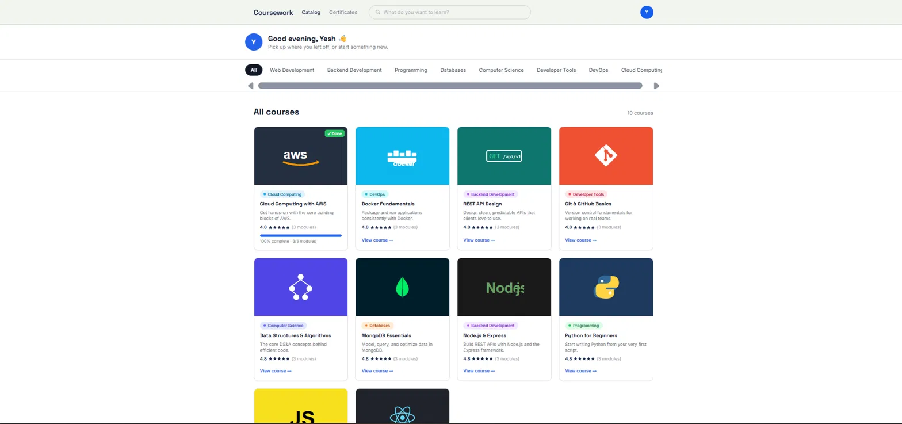
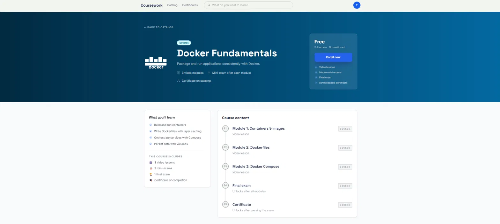
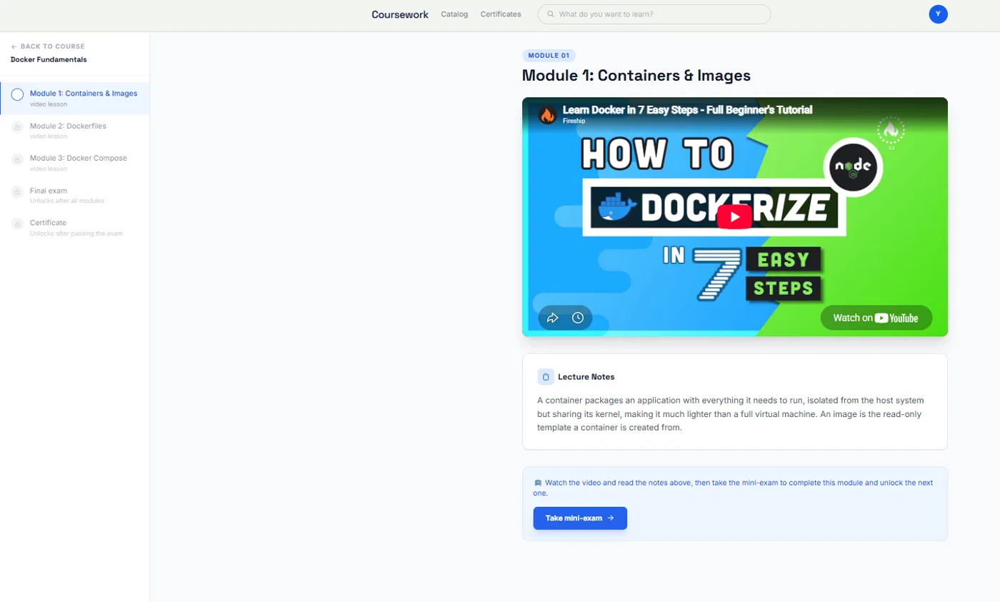
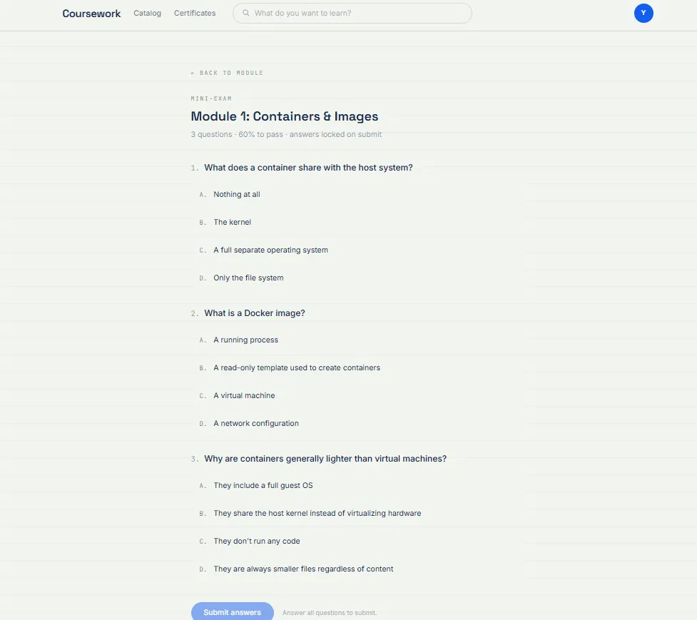
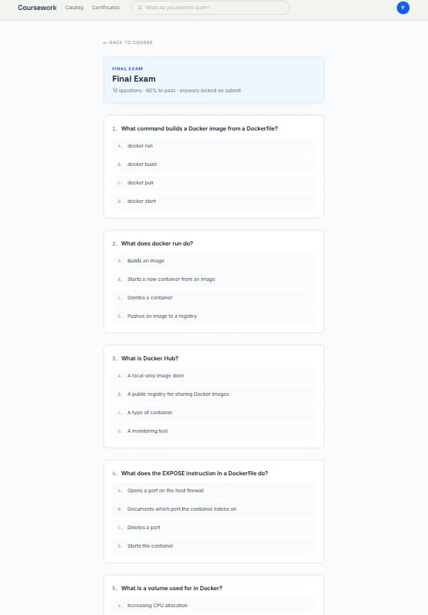
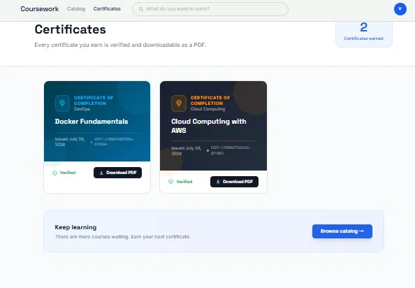

# 🎓 LearnSphere AI 🤖

**AI-powered personalized education platform — live and deployed.**

[](https://learn-sphere-ai-lilac.vercel.app/)
[](https://learnsphere-ai-zt5x.onrender.com/)
[](#-license)

🔗 **Live App:** [learn-sphere-ai-lilac.vercel.app](https://learn-sphere-ai-lilac.vercel.app/)
🔗 **Backend API:** [learnsphere-ai-zt5x.onrender.com](https://learnsphere-ai-zt5x.onrender.com/)

> ⚠️ **Note:** The backend is hosted on Render's free tier, so the first request after a period of inactivity may take 30–60 seconds while the server spins up.

---

LearnSphere AI is an **AI-powered personalized education platform** designed to adapt learning content based on a student's performance, strengths, and weaknesses. The system follows an intelligent learning loop that teaches concepts, evaluates understanding through quizzes, and dynamically updates the learner's profile to optimize future explanations.

This project was developed as part of a **Personalized Education / AI-Powered Learning** initiative and is suitable for hackathons, academic projects, and scalable real-world learning platforms.

---

## 📸 Screenshots

### Course Catalog & Dashboard
Browse all courses, track progress, and pick up where you left off.


### Course Detail Page
Course overview with modules, learning outcomes, and enrollment.



### Module Lesson View
Video lessons paired with lecture notes for each module.



### Mini-Exam
Quick module-level checks to unlock the next lesson.



### Final Exam
Comprehensive assessment covering all course modules.



### Certificates
Verified, downloadable certificates upon course completion.



---

## 🚀 Project Vision

Traditional learning platforms provide the same content to all learners. LearnSphere AI changes this by:

- Personalizing learning paths for each student
- Continuously adapting content difficulty
- Using AI-driven evaluation and feedback loops
- Improving student engagement and learning outcomes

---

## 🧠 Core Learning Flow

The platform follows this intelligent flow:

1. **Teach Topic** – Present learning content
2. **Generate Quiz** – Automatically generate assessment questions
3. **Evaluate Answers** – Analyze student responses
4. **Update Student Profile** – Track strengths & weaknesses
5. **Modify Next Explanation** – Adapt the next lesson accordingly

This loop repeats to ensure continuous improvement.

---

## 🏗️ System Architecture

```
LearnSphere-AI/
├── frontend/           # React.js frontend
├── backend/            # Node.js / Express backend
├── screenshots/         # App screenshots used in this README
├── README.md
└── .gitignore
```

---

## 🌐 Live Deployment

| Service | Platform | URL |
|---------|----------|-----|
| Frontend | Vercel | https://learn-sphere-ai-lilac.vercel.app/ |
| Backend / API | Render | https://learnsphere-ai-zt5x.onrender.com/ |

---

## 🎨 Frontend (React.js)

### 🔹 Features

- User Authentication (Login & Signup)
- Dashboard for learners
- Topic-based learning interface
- Quiz UI with real-time evaluation
- Personalized feedback display
- Clean, responsive UI

### 🔹 Tech Stack

- React.js
- React Router
- CSS / Tailwind CSS
- Axios (API communication)
- Deployed on **Vercel**

---

## ⚙️ Backend (Node.js + Express)

### 🔹 Features

- RESTful APIs for frontend
- Quiz generation logic
- Answer evaluation system
- Student profile management
- AI integration (LLM-based evaluation)
- Secure environment variable handling

### 🔹 Tech Stack

- Node.js
- Express.js
- MongoDB (or JSON/DB-based storage)
- Groq / LLM API (AI logic)
- dotenv for environment variables
- Deployed on **Render**

---

## 🔐 Environment Variables

Sensitive keys are stored securely using environment variables — never committed to the repo.

---

## 📦 Local Installation & Setup

Prefer to run it locally? Follow these steps.

### 1️⃣ Clone the Repository

```bash
git clone https://github.com/yash024825/LearnSphere-AI.git
cd LearnSphere-AI
```

### 2️⃣ Frontend Setup

```bash
cd frontend
npm install
npm start
```

Frontend will run at: `http://localhost:3000`

### 3️⃣ Backend Setup

```bash
cd backend
npm install
npm start
```

Backend will run at: `http://localhost:5000`

---

## 🧪 Sample Use Case

1. Student logs in
2. Selects a topic (e.g., Neural Networks)
3. System teaches the topic
4. Quiz is generated automatically
5. Student submits answers
6. AI evaluates performance
7. Learning profile updates
8. Next explanation is personalized

---

## 🎯 Use Cases

- Personalized e-learning platforms
- AI tutors
- Adaptive exam preparation systems
- College & school LMS enhancements
- Hackathons & research projects

---

## 🌟 Future Enhancements

- Student analytics dashboard
- Teacher/admin panel
- Multi-language support
- Voice-based AI tutor
- Recommendation system for learning paths
- ~~Cloud deployment (AWS / Vercel / Render)~~ ✅ **Done** — live on Vercel & Render

---

## 🛡️ Security Best Practices

- API keys stored in `.env`
- `.env` ignored via `.gitignore`
- No secrets committed to GitHub
- Secure authentication flow

---

## 👨‍💻 Author

**Yashwanth Tatikonda**
B.Tech Student | AI & Full Stack Developer
GitHub: [https://github.com/yash024825](https://github.com/yash024825)

---

## 📄 License

This project is for **educational and academic use**. You are free to modify and extend it for learning purposes.

---

## ⭐ Support

If you found this project helpful:

- ⭐ Star the repository
- 🍴 Fork it
- 🧠 Build something amazing!

**LearnSphere AI – Smarter Learning, One Student at a Time 🚀**
